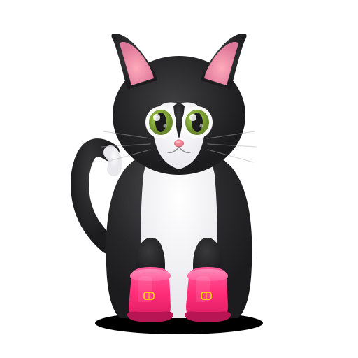

<p align="center">
  
</p>

<h1 align="center">Passion-Led Learning Agent</h1>

<h3 align="center">What if Preply knew what you love before lesson 1?</h3>

<p align="center">
  A voice AI that replaces static forms with a 90-second conversation,<br>
  discovers your passions, and builds a personalized learning bridge<br>
  between what you love and what you need to learn.
</p>

<p align="center">
  <a href="https://botas.vercel.app"></a>
  <a href="https://botas.vercel.app/pitch.html"></a>
  <a href="https://botas.vercel.app/pitch-30s.html"></a>
</p>

<p align="center">
  
  
  
  
  
</p>

---

## The problem

> **73% of language learners quit within 3 months.** Not because learning is hard. Because no one really understood what they care about.

| | Before (current Preply) | After (our agent) |
|:---:|---|---|
| **Onboarding** | Fill a form, pick from a list | Talk for 90 seconds about what you love |
| **Matching** | Filter by price, rating, availability | AI maps your passions to the right tutor |
| **First lesson** | Tutor starts from zero | Tutor gets a full passion profile before lesson 1 |
| **Retention** | 73% quit within 3 months | Lessons built around your interests keep you engaged |

---

## How it works

```
  Click "Find your tutor"          Voice interview             AI classification           Learning bridge

       +----------+            +------------------+         +------------------+       +------------------+
       |          |            |                  |         |                  |       |                  |
       |  Preply  |  -------> |   Agora ConvoAI  | ------> |  OpenAI GPT-5.4  | ----> |  Your passions   |
       |  Landing |            |   90s voice chat |         |  Profile + Plan  |       |      +           |
       |          |            |                  |         |                  |       |  Your goals      |
       +----------+            +------------------+         +------------------+       +------------------+
                                       |                                                       |
                                       v                                                       v
                               +------------------+                                   +------------------+
                               |     Thymia       |                                   |   Tutor match    |
                               |  Cognitive load  |                                   |  Personalized    |
                               |  Engagement      |                                   |  weekly plan     |
                               +------------------+                                   +------------------+
```

| Step | What happens |
|:---:|---|
| **1** | Learner arrives at a Preply-style homepage and clicks "Find your tutor" |
| **2** | 90-second real-time voice conversation explores interests, goals, and hidden passions |
| **3** | GPT-5.4 analyzes the transcript into a structured learner profile |
| **4** | A personalized plan connects what they *love* to what they *need* to learn |

---

## The insight

> Research on interest development (Hidi & Renninger, 2006) shows that **triggered situational interest** is the strongest predictor of sustained motivation.

We use voice AI to *find* that passion, then *build the bridge* from passion to skill.

---

## Tech stack

| Technology | Role | Why |
|:---:|---|---|
| **Agora ConvoAI** | Real-time voice AI interview | Sub-300ms latency, natural conversation |
| **OpenAI GPT-5.4** | LLM + TTS + classification | One API for conversation, voice, and profiling |
| **Thymia** | Cognitive signal analysis | Detects engagement, confidence, cognitive load |
| **Next.js 16** | App Router + Turbopack | Fast, modern React with server components |
| **Vercel** | Edge deployment | Zero-config, instant deploys |

---

## Multilingual

The site auto-detects your browser language:

| Language | UI | Voice agent |
|:---:|:---:|:---:|
| Portuguese (pt-BR) | Portuguese | Speaks Portuguese |
| Spanish (es) | Spanish | Speaks Spanish |
| Others | English | Speaks English |

---

## Quick start

```bash
git clone https://github.com/mrncstt/preply-hackathon.git
cd preply-hackathon/prototype
cp .env.example .env.local
npm install
npm run dev
```

Three env vars:

```env
AGORA_ID=              # Agora Console
AGORA_APP_CERTIFICATE= # Agora Console
OPEN_AI_API_KEY=       # OpenAI
```

---

## Team

| | Name | Role |
|:---:|---|---|
| **MC** | Mariana Costa | Data |
| **TL** | Timur Losev | DevOps / AI |

---

<p align="center">
  <br>
  Built with coffee, desperation, and AI<br>
  <strong>Preply x Agora Hackathon</strong> / Barcelona 2026
</p>
