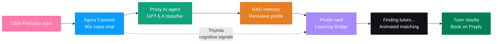

<p align="center">
  
</p>

<h1 align="center">Passion-Led Learning Agent</h1>

<h3 align="center">What if Preply knew what you love before lesson 1?</h3>

<p align="center">
  A voice AI that replaces static forms with a 90-second conversation,<br>
  discovers your passions, and builds a personalized learning bridge<br>
  between what you love and what you need to learn.
</p>

<p align="center">
  <a href="https://botas.vercel.app"></a>
  <a href="https://botas.vercel.app/submission-pitch.html"></a>
  <a href="https://botas.vercel.app/short-pitch.html"></a>
</p>

<p align="center">
  
  
  
  
  
</p>

---

## 1 min: The problem

> **73% of language learners quit within 3 months.** Not because learning is hard. Because no one really understood what they care about.

| | Before (current Preply) | After (our agent) |
|:---:|---|---|
| **Onboarding** | Fill a form, pick from a list | Talk for 90 seconds about what you love |
| **Matching** | Filter by price, rating, availability | AI maps your passions to the right tutor |
| **First lesson** | Tutor starts from zero | Tutor gets a full passion profile before lesson 1 |
| **Retention** | Generic first lesson | Lessons built around your interests |

---

## 1 min: The solution

**AI Discovery Coach**: a 90-second multilingual voice interview that discovers your passions and matches you with the right tutor.



| Step | What happens |
|:---:|---|
| **1** | Learner arrives at a Preply-style homepage and clicks "Find your tutor" |
| **2** | 90-second voice conversation with Thymia cognitive signals (engagement, confidence, cognitive load) |
| **3** | Agent auto-ends after 7-8 exchanges, GPT-5.4 analyzes transcript into structured profile |
| **4** | Profile saved to RAG persistent memory for tutor context |
| **5** | Profile card with Learning Bridge connecting passions to language goals |
| **6** | "Finding tutors who will motivate, support, inspire you..." animated matching |
| **7** | Tutor results page with AI-matched cards linking to Preply signup |

---

## 3 min: Live demo

### Demo flow

```
1. Landing page (Preply clone) -> click "Find your tutor"
2. Voice interview (90s, Agora ConvoAI + Thymia signals)
3. Agent wraps up naturally after 7-8 exchanges
4. "Analyzing your interview..." (GPT-5.4 classification)
5. Profile saved to RAG persistent memory
6. Profile card (Learning Bridge, passions, goals, barriers)
7. Click "Find your tutor" -> animated matching screen
8. Tutor results (3 AI-matched cards -> preply.com)
```

### Example conversation

> **Coach:** "Hey! I'm your Discovery Coach at Preply. In about 90 seconds, I'll get to know you and build a learning plan that fits your life. So, what language have you been wanting to learn?"
>
> **Learner:** "I want to learn Spanish. I'm moving to Barcelona."
>
> **Coach:** "What are you passionate about outside work?"
>
> **Learner:** "I love cooking Italian food and watching football."
>
> **Coach:** "Love it! Cooking and football are goldmines for immersive Spanish. Let me build something around that."

### Learning Bridge result

> "Master Spanish vocabulary through cooking recipe videos and football match commentary in Spanish"

**The tutor gets this profile before lesson 1. The first session is never a blank slate.**

---

## Why this wins

- **vs. Duolingo/Babbel:** They ask "why are you learning?" with 5 radio buttons. We have an open-ended voice conversation that surfaces passions no form would capture.
- **vs. ChatGPT voice:** Great for practice, but it does not connect to a real tutor marketplace. We feed insights directly into Preply tutor matching.
- **vs. current Preply:** The tutor gets a structured learner profile before lesson 1. First-session retention is the highest-leverage metric for a tutoring marketplace.

---

## Tech stack

| Technology | Role | Why |
|:---:|---|---|
| **Agora ConvoAI** | Real-time voice AI interview | Sub-300ms latency, natural conversation |
| **OpenAI GPT-5.4** | LLM + TTS + classification | One API for conversation, voice, and profiling |
| **Thymia** | Cognitive signal analysis | Detects engagement, confidence, cognitive load in real-time |
| **Next.js 16** | App Router + Turbopack | Fast, modern React with server components |
| **Vercel** | Edge deployment | Zero-config, instant deploys |

---

## Multilingual voice agent

The AI Discovery Coach detects your language and responds naturally:

| You speak | Agent responds in | Profile output |
|:---:|:---:|:---:|
| Portuguese | Portuguese | English |
| Spanish | Spanish | English |
| Any language | Same language | English |

---

## Quick start

```bash
git clone https://github.com/mrncstt/preply-hackathon.git
cd preply-hackathon/prototype
cp .env.example .env.local
npm install
npm run dev
```

Three env vars:

```env
AGORA_ID=              # Agora Console
AGORA_APP_CERTIFICATE= # Agora Console
OPEN_AI_API_KEY=       # OpenAI
```

---

## Team

| | Name | Role |
|:---:|---|---|
| **MC** | Mariana Costa | Data |
| **TL** | Timur Losev | DevOps / AI |

---

## Resources

| Resource | Link |
|:---:|---|
| Live demo | [botas.vercel.app](https://botas.vercel.app) |
| Submission pitch | [botas.vercel.app/submission-pitch.html](https://botas.vercel.app/submission-pitch.html) |
| Short pitch | [botas.vercel.app/short-pitch.html](https://botas.vercel.app/short-pitch.html) |
| Long pitch | [botas.vercel.app/long-pitch.html](https://botas.vercel.app/long-pitch.html) |
| Prompts reference | [botas.vercel.app/prompts.md](https://botas.vercel.app/prompts.md) |
| Testing guide | [docs/TESTING.md](docs/TESTING.md) |
| Submission doc | [docs/SUBMISSION.md](docs/SUBMISSION.md) |

---

<p align="center">
  <br>
  Stop teaching languages. Start discovering learners.<br>
  <strong>Built in 24h</strong> / Preply x Agora Hackathon / Barcelona 2026
</p>
